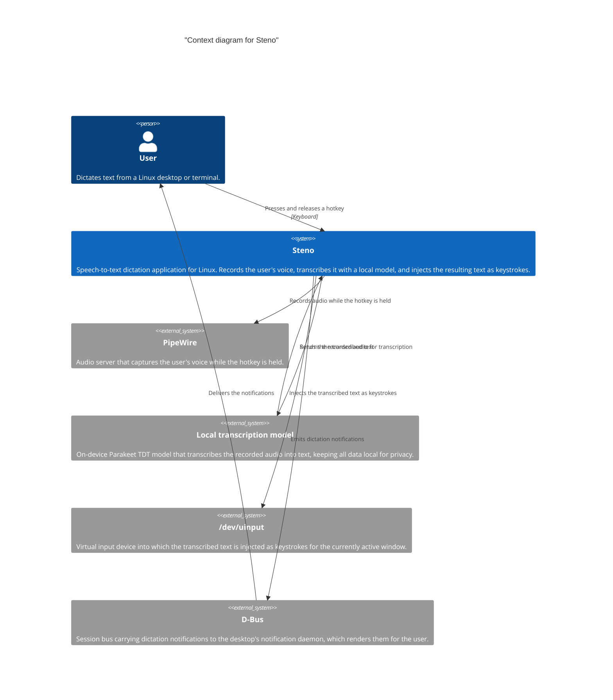

# Context and scope

This section covers the context and scope of the system. 

The figure below shows Steno in its environment: the people and external
systems it interacts with. A user presses a hotkey to record their voice
through PipeWire; as soon as they release it, the recorded audio is
transcribed by a local model and the resulting text is injected as keystrokes
into the virtual input device (`/dev/uinput`). Notifications for the start of
recording, the start of transcription, and the completion of the dictation are
emitted as desktop notifications over D-Bus.

