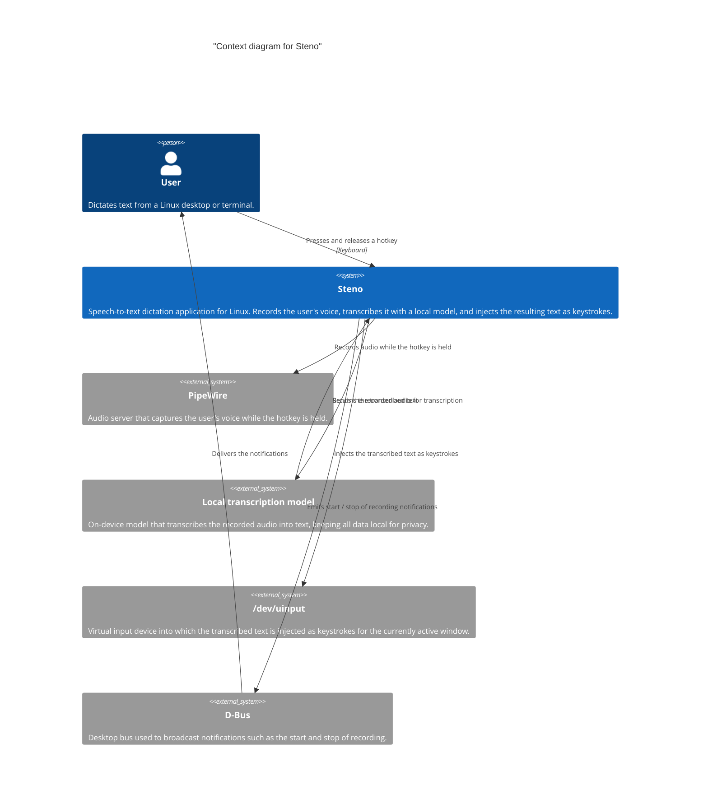
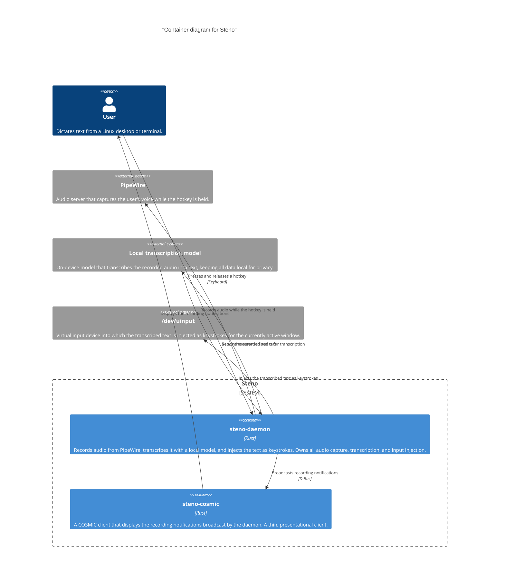

# Building block view

This section documents the building blocks of Steno and how they relate. It
starts from the top level — Steno in its environment — and drills down to the
containers that make up the system.

## Context

The figure below shows Steno at the top level: the people and external systems
it interacts with. A user presses a hotkey to record their voice through
PipeWire; as soon as they release it, the recorded audio is transcribed by a
local model and the resulting text is injected as keystrokes into the virtual
input device (`/dev/uinput`). Notifications such as the start and stop of
recording are broadcast over D-Bus.

## Application processes

Steno is split into two processes. `steno-daemon` is a process that
records audio from PipeWire, transcribes it with a local model, and injects the
text as keystrokes; it owns all audio capture, transcription, and input
injection. `steno-cosmic` is a COSMIC client that displays the recording
notifications broadcast by the daemon. Communication between the two is 
one-directional: the daemon broadcasts notifications over D-Bus, and the client 
only listens, so it never sends commands back to the daemon.

