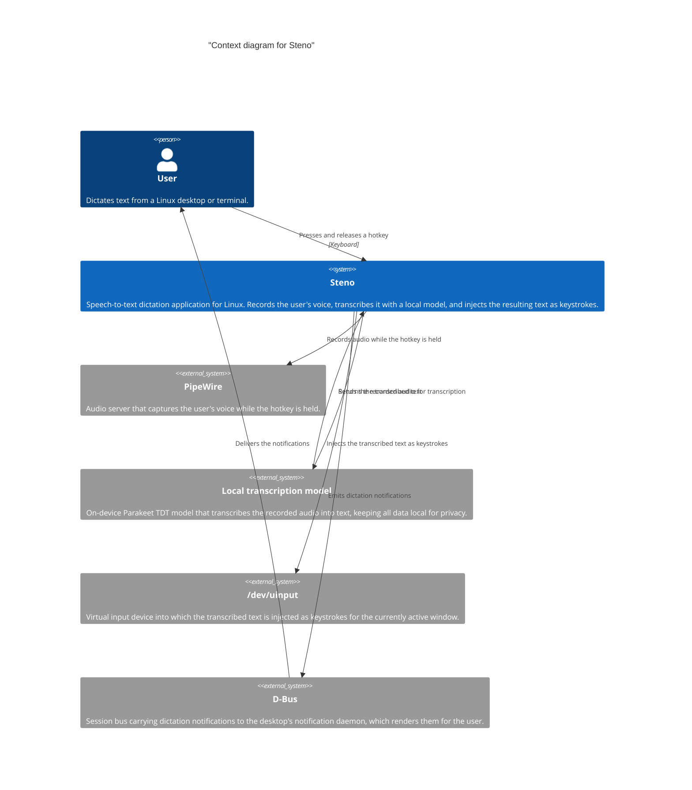
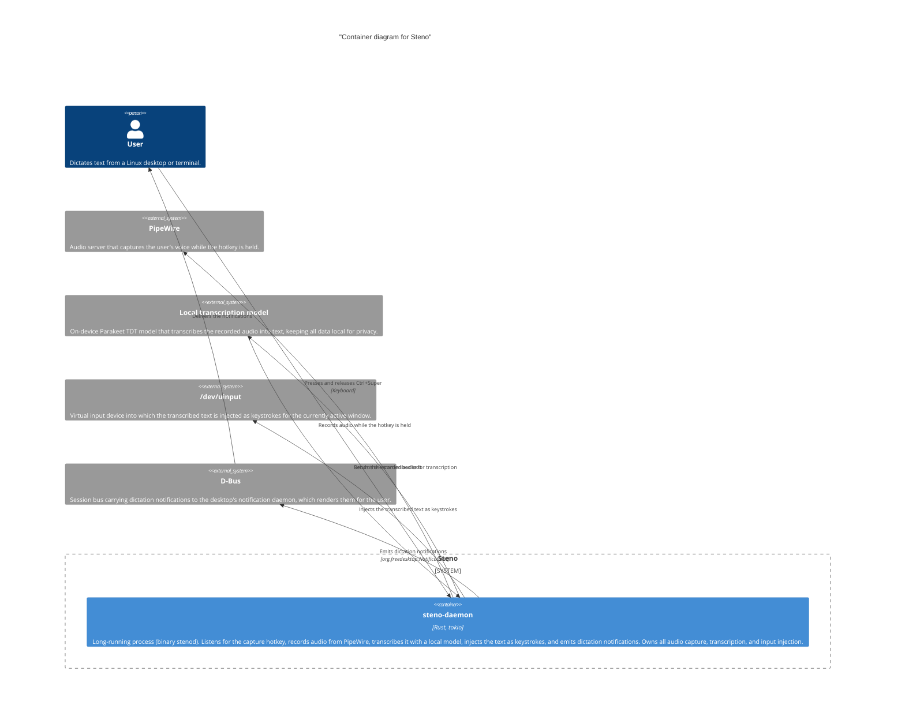
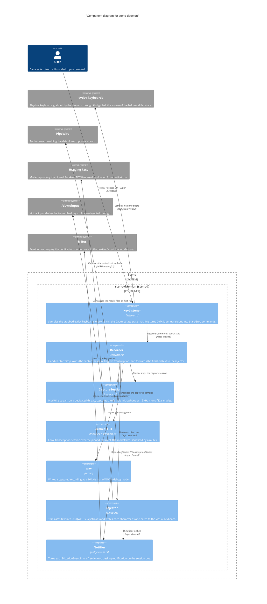

# Building block view

This section documents the building blocks of Steno and how they relate. It
starts from the top level — Steno in its environment — and drills down to the
containers and components as they are currently implemented.

## Context

The figure below shows Steno at the top level: the people and external systems
it interacts with. A user presses a hotkey to record their voice through
PipeWire; as soon as they release it, the recorded audio is transcribed by a
local model and the resulting text is injected as keystrokes into the virtual
input device (`/dev/uinput`). Notifications for the start of recording, the
start of transcription, and the completion of the dictation are emitted as
desktop notifications over D-Bus.

## Application processes

Steno is currently a single process: `steno-daemon` (binary `stenod`), an
async Rust daemon built on `tokio`. It listens for the capture hotkey
(<kbd>Ctrl</kbd>+<kbd>Super</kbd>) on evdev keyboards, records audio from
PipeWire while the hotkey is held, transcribes the audio with a local Parakeet
TDT model, injects the resulting text as keystrokes through a virtual keyboard
registered on `/dev/uinput`, and announces each stage as a standard
freedesktop desktop notification over D-Bus. It ships as a systemd user
service; a failing capture path makes the daemon exit non-zero.

The notification path does not need a dedicated client such as the previously
planned COSMIC app `steno-cosmic`: the calls ride the standard
`org.freedesktop.Notifications` interface, so the notification daemon that
ships with the user's desktop environment renders them. The `steno-cosmic`
crate is an empty scaffold and is not part of the diagrams below.
Communication stays one-directional: the daemon only emits notifications and
never accepts commands back.

## Daemon components

`main.rs` wires the daemon together as a handful of tasks connected by
channels:

- `KeyListener` (`listener.rs`) grabs the evdev keyboards and samples the
  held modifiers every 15 ms; a pure `CaptureState` state machine turns
  `Ctrl+Super` transitions into `Start`/`Stop` commands for the `Recorder`.
- `Recorder` (`recorder.rs`) owns the `CaptureSession` (`capture.rs`), a
  PipeWire stream running on its own thread that captures the default
  microphone as 16 kHz mono f32 samples. On stop, the samples are
  transcribed off the async runtime by the `ParakeetTDT` session, and the
  resulting text is handed to the `Injector` through a FIFO channel. In
  `--debug` mode each recording is also written as a WAV file
  (`wav.rs`) under `/tmp/steno`.
- `Injector` (`uinput.rs`) translates text into keystrokes on a US-QWERTY
  keymap and writes each character as a single batch to the virtual keyboard
  `steno-virtual-keyboard`; characters with no keyboard representation are
  skipped, never fatal.
- `Notifier` (`notifications.rs`) owns the D-Bus session connection and turns
  each `DictationEvent` into an `org.freedesktop.Notifications.Notify` call:
  `RecordingStarted` and `TranscriptionStarted` come from the `Recorder`,
  `DictationFinished` from the `Injector` once the text has fully landed.
  Delivery is best-effort — an unreachable bus downgrades notifications to
  discard mode and never affects recording, transcription, or injection.
- `model.rs` provisions the pinned Parakeet TDT files, downloading them from
  Hugging Face on first run into `$XDG_CONFIG_HOME/steno/models/parakeet`.
  The session loads with the CUDA execution provider when built with the
  default `cuda` feature, falling back to CPU. The `KeyListener` is only
  constructed after the model has loaded, so `Ctrl+Super` is never swallowed
  while nothing can be captured.

