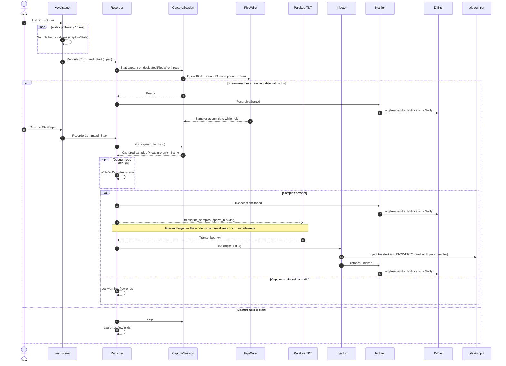

# Runtime view

This section describes how Steno behaves at runtime. Component names refer to
the [Building block view](05-building-block-view.md).

## Recording flow

One dictation, from hotkey press to injected text:

Behavior the diagram cannot show:

- A new press during inference starts a second recording immediately; the
  model mutex queues its transcription behind the first.
- Notifications are best-effort: with no session bus the `Notifier` discards
  events and the rest of the flow is unaffected.
- Characters with no US-QWERTY mapping are skipped with a warning; injection
  of the remaining text continues.
