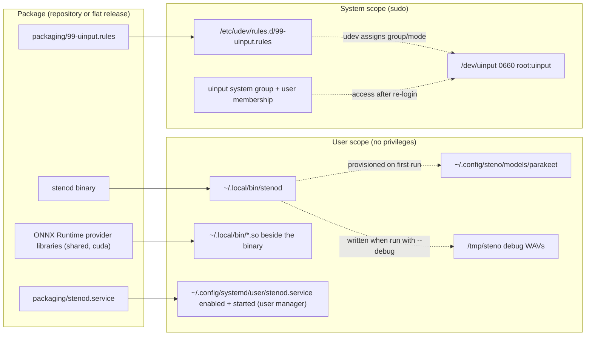

# Deployment view

This section describes how the Steno package is deployed onto a machine.

## Installation layout

`scripts/install.sh` deploys the package in two scopes: user-owned paths need
no privileges, one privileged step (via `sudo`) installs the device access.
Re-running is safe — every step overwrites its own target.

Notes the diagram cannot show:

- **Provider libraries ride with the binary.** ONNX Runtime dlopen's its
  execution providers relative to `$ORIGIN`, so they must sit next to
  `stenod`; when they are missing the installer warns and transcription falls
  back to CPU.
- **The unit sandboxes device access.** `DevicePolicy=closed` allows only
  `/dev/uinput` (rw). The user D-Bus and PipeWire sockets stay reachable —
  they are socket files, not device nodes.
- **Group membership needs a re-login.** `usermod -aG uinput` only takes
  effect on the next login; the enabled service gains injection access then.
- **Model files and debug WAVs are not installed.** The daemon downloads the
  pinned Parakeet TDT files into `~/.config/steno/models/parakeet` on first
  run and writes WAVs only when started with `--debug`.
- **Requires systemd.** The preflight fails without a reachable user systemd
  manager, so installation happens inside a graphical session.
